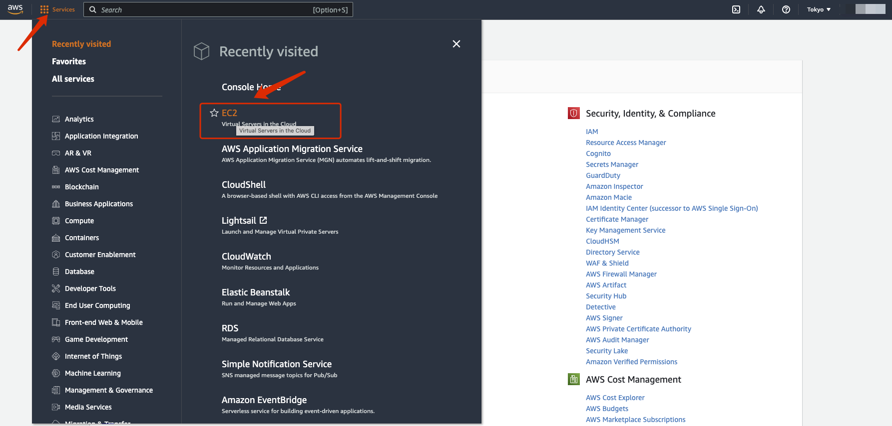
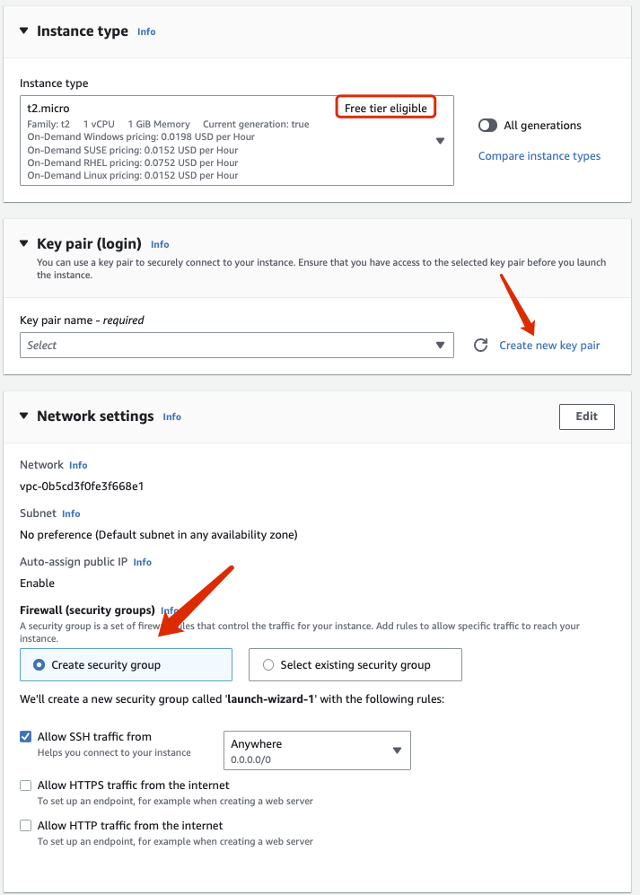
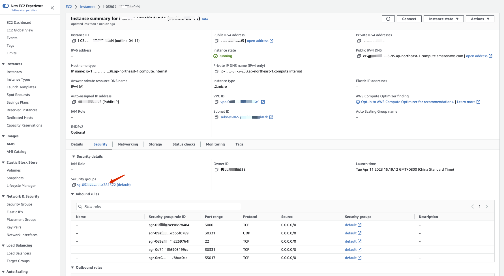
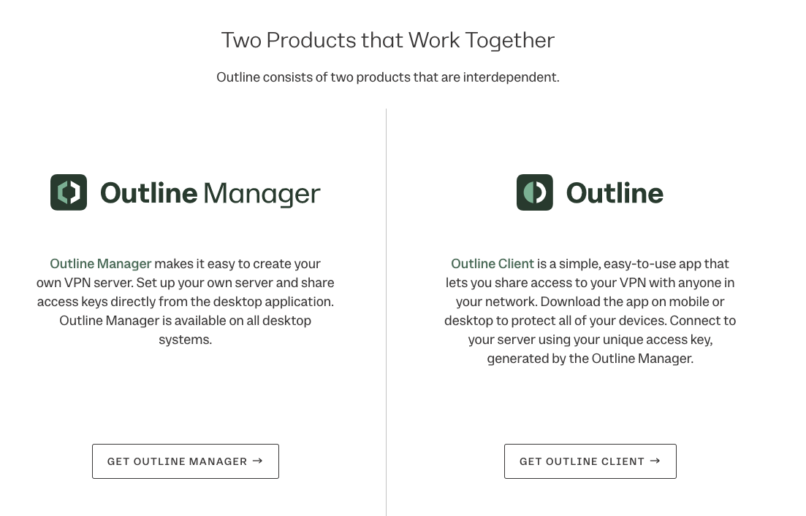
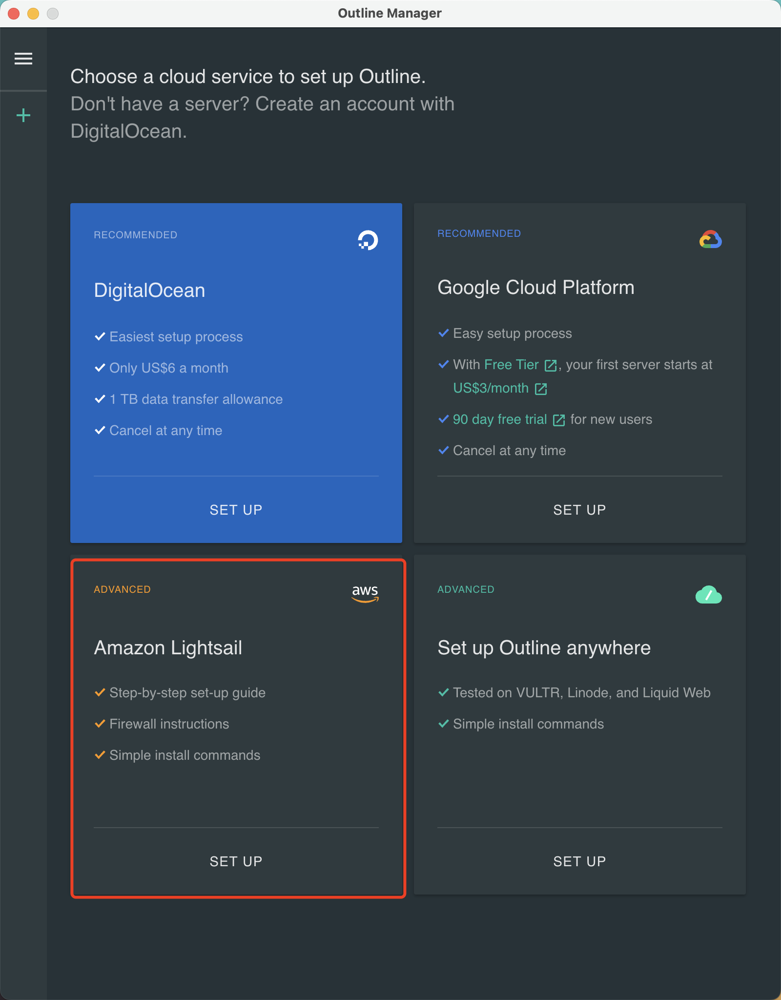
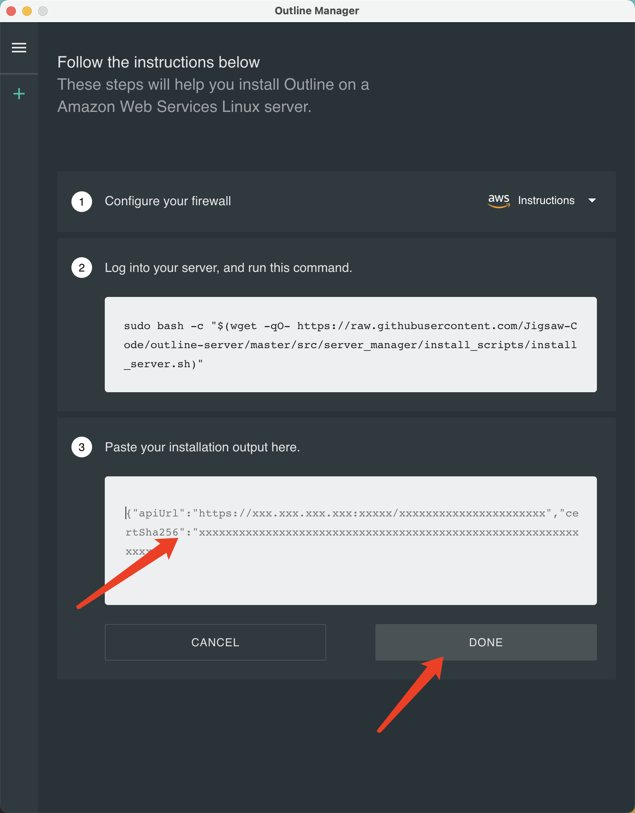

# Basic VPN Setup Tutorial   
## **Part 1**: Get a free AWS EC2 to run the VPN service  

1. Sign up for a new AWS account to get the free tier. Just follow AWS guide.  

    **Note**: You need a credit or debit card when you sign up.

    > - This is the [sign up page](https://portal.aws.amazon.com/billing/signup#/start/email "Sign up your account").  

    > - This is the [AWS Free Tier](https://aws.amazon.com/cn/free "Learn about the free tier").  
  
2. Now you already have an AWS account. We can start create EC2 server.

    1. Sign in your account [here](https://aws.amazon.com/cn/console/).  

    2. Choose a region where you want to deploy the server.  
    

    3. Go to EC2 service.  
    

    4. Launch a new instance.
    

    **Note: Be careful from here and keep an eye on whether the service you choose is included in the free tier.**  

    5. Set the name for your instance and choose an AMI.
    

    6. Select free instance type and create new key pair, about the network settings, choose create security group.
    

    7. Configure storage to 30GB, this is in the free tier.
    

    8. Click the Launch instance button to get your own free EC2 instance.

## Part 2: Start setup VPN service on your EC2

1. Connect to your instance.
  

2. Next we install outline VPN server in docker. Execute the following commands one by one in the console.  

    1. `` sudo -- sh -c 'apt-get update; apt-get upgrade -y; apt-get dist-upgrade -y; apt-get autoremove -y; apt-get autoclean -y' ``  

    2. ``sudo curl -sS https://get.docker.com/ | sh``  

    3. ``sudo systemctl start docker``  

    4. ``sudo systemctl enable docker``  

    5. ``sudo systemctl status docker``

    6. ``sudo wget -qO- https://raw.githubusercontent.com/Jigsaw-Code/outline-server/master/src/server_manager/install_scripts/install_server.sh | bash``
    
3. Finally you maybe see this. Firewall blocked. Don't worry. Let's configure the security group. Keep the console here and we will use the messages later.

4. Go to security group page.  
  

5. Edit inbound rules, add three rules according to the port and traffic type prompted by the console before.

6. Now we have completed the setup of the VPN server, copy the apiUri in green and you can close AWS console now.

## Part 3: Download Outline manager and Outline client.
1. Go to the official website of [Outline](https://getoutline.org/).  

2. Download the Outline Manager on your computer and the Outline client on where you want to use VPN.  

3. Configure the Outline Manager first.
    1. Choose AWS.  
      

    2. Paste your apiUri here and done.  
    

4. Now you can use your access key in the Outline cline to cross the wall.

## Finish